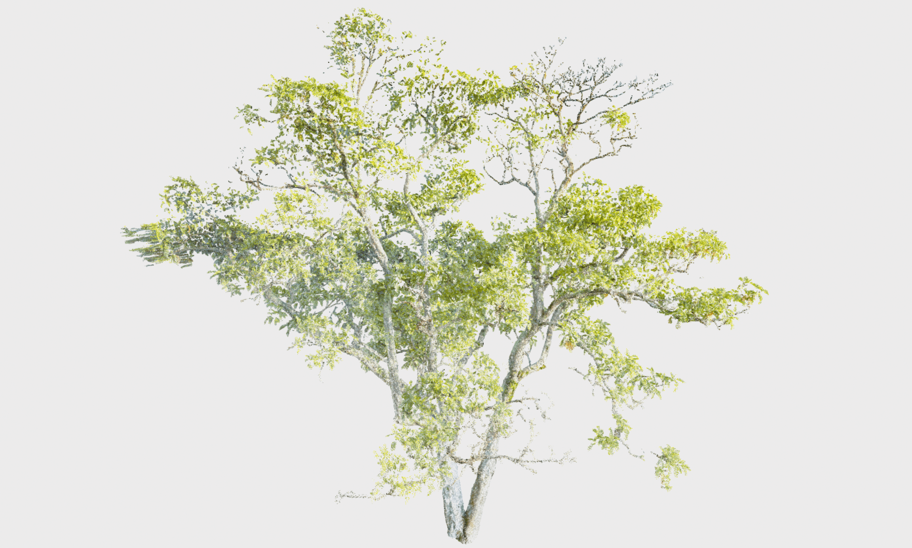
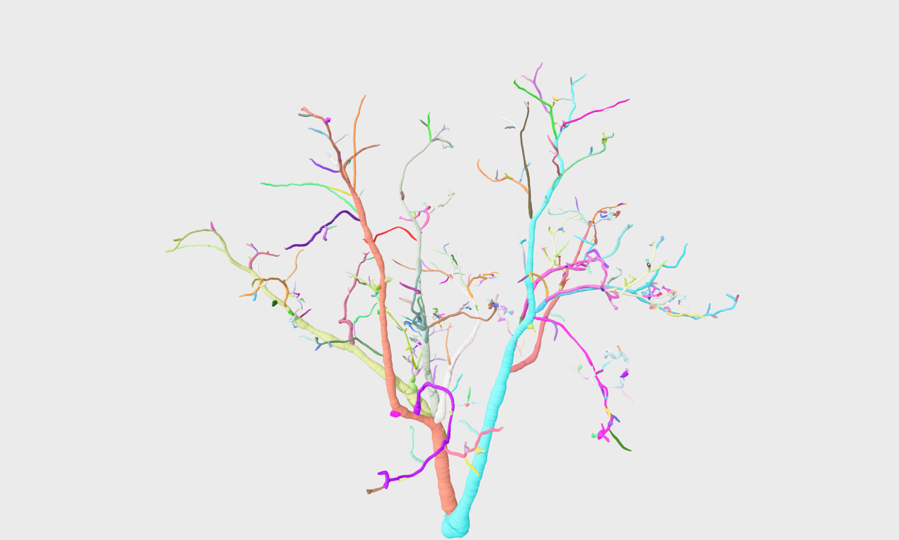
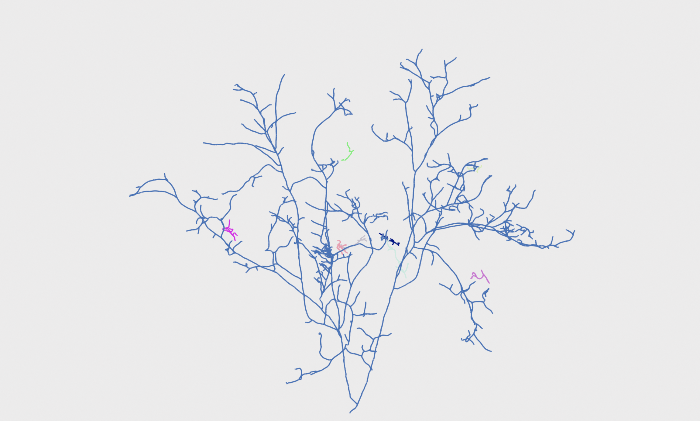

# <center> 💡🧠🤔 Smart-Tree 🌳🌲🌴 </center>

## 📝 Description:

This repository contains code from the paper "Smart-Tree: Neural Medial Axis Approximation of Point Clouds for 3D Tree Skeletonization". <br>
The code provided is a deep-learning-based skeletonization method for point clouds.

<table>
<tr>
  <td style="text-align: center"></td>
  <td style="text-align: center"></td>
  <td style="text-align: center"></td>
</tr>
<tr>
  <td align="center">Input point cloud.</td>
  <td align="center">Mesh output.</td>
  <td align="center">Skeleton output.</td>
</tr>
</table>


## 💾 Data:

Please follow instructions to download data from this <a href="https://github.com/uc-vision/synthetic-trees">link</a>. <br>

## 🔧 Installation:

First, make sure you have Conda installed, aswell as <a href="https://www.anaconda.com/blog/a-faster-conda-for-a-growing-community">mamba</a>.
This will ensure the enviroment is created within a resonable timeframe.

To install smart-tree please use <br>`bash create-env.sh`<br>
Then activate the environment using: <br>`conda activate smart-tree`


## 📈 Training:

To train the model open smart_tree/conf/training.yaml.

You will need to update (alternatively these can be overwritten with hydra): 

- training.dataset.json_path to the location of where your smart_tree/conf/tree-split.json is stored. 
- training.dataset.directory to the location of where you downloaded the data (you can choose whether to train on the data with foliage or without based on the directory you supply).

You can experiment with/adjust hyper-parameter settings too.

The model will then train using the following:

`train-smart-tree`

The best model weights and model will be stored in the generated outputs directory.

## ▶️ Inference / ☠️ Skeletonization:

We supply two different models with weights:
* `noble-elevator-58` contains branch/foliage segmentation. <br>
* `peach-forest-65` is only trained on points from the branching structure. <br>

If you wish to run smart-tree using your own weights you will need to update the model paths in the `tree-dataset.yaml`. <br>

To run smart-tree use: <br>
`run-smart-tree +path=cloud_path` <br>
where `cloud_path` is the path of the point cloud you want to skeletonize. <br>
Skeletonization-specific parameters can be adjusted within the `smart_tree/conf/tree-dataset.yaml` config.

## 📜 Citation:
Please use the following BibTeX entry to cite our work: <br>

```
@inproceedings{dobbs2023smart,
  title={Smart-Tree: Neural Medial Axis Approximation of Point Clouds for 3D Tree Skeletonization},
  author={Dobbs, Harry and Batchelor, Oliver and Green, Richard and Atlas, James},
  booktitle={Iberian Conference on Pattern Recognition and Image Analysis},
  pages={351--362},
  year={2023},
  organization={Springer}
}
```
## Star History

[](https://star-history.com/#uc-vision/smart-tree&Date)


## 📥 Contact 

Should you have any questions, comments or suggestions please use the following contact details:
harry.dobbs@pg.canterbury.ac.nz
